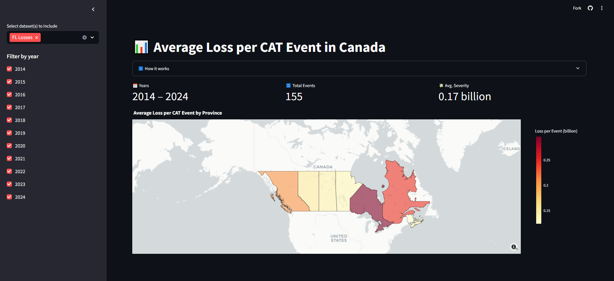

# Canada CAT-Event Severity Web App

A Streamlit application that lets you explore the **average loss per catastrophic (CAT) event** across Canadian provinces over time. Select one or more preloaded datasets, filter by year, and view an interactive choropleth map of severity (loss per event in billions of CAD).

---

## Features

- **Multiple datasets**: Toggle between FL, HL, FI, and WS loss-data CSVs.  
- **Year filtering**: Pick which event years to include via sidebar checkboxes.  
- **Data validation**: Auto-checks for required columns and valid region/province codes.  
- **Summary metrics**: Displays total years spanned, total event count, and overall average severity.  
- **Interactive Map**: A Plotly/Mapbox choropleth showing province-level severity, with hover-over tooltips.

---

## Table of Contents

1. [Demo](#demo-screenshot)  
2. [Installation](#installation)  
3. [Usage](#usage)  
4. [Project Structure](#project-structure)  
5. [Data Files](#data-files)  
6. [Configuration & Customization](#configuration--customization)  
7. [Dependencies](#dependencies)  
8. [License](#license)

---

## Live Demo

[Try the app in your browser →](https://quantifyheatmap-x9rs26tpfisbyn8s9inrox.streamlit.app/)

## Demo Screenshot

---

## Installation

1. **Clone the repo**  
   
   \\\`\\\`\\\`bash  
   git clone https://github.com/yourusername/canada-cat-severity.git  
   cd canada-cat-severity  
   \\\`\\\`\\\`

2. **Create & activate a Python virtual environment**  
   
   \\\`\\\`\\\`bash  
   python3 -m venv .venv  
   source .venv/bin/activate      # macOS/Linux  
   .\\.venv\\Scripts\\Activate.ps1   # Windows PowerShell  
   \\\`\\\`\\\`

3. **Install dependencies**  
   
   \\\`\\\`\\\`bash  
   pip install -r requirements.txt  
   \\\`\\\`\\\`

---

## Usage

1. **Ensure your CSV data files** (see [Data Files](#data-files)) are in the project root.  
2. **Run the app**  
   
   \\\`\\\`\\\`bash  
   streamlit run app.py  
   \\\`\\\`\\\`

3. **Interact via your browser**  
   - Use the **sidebar** to select datasets and years.  
   - Hover over provinces on the map to see “Loss per Event.”  
   - Watch the summary metrics update automatically.

---

## Project Structure

\\\`\\\`\\\`text  
.  
├── app.py  
├── requirements.txt  
├── Quantify Case Competition 2025 Case Data FL.csv  
├── Quantify Case Competition 2025 Case Data HL.csv  
├── Quantify Case Competition 2025 Case Data FI.csv  
├── Quantify Case Competition 2025 Case Data WS.csv  
└── assets/  
    └── demo.png  
\\\`\\\`\\\`

- **app.py**  
  Main Streamlit application (see code comments for sections: config, data-loading, filtering, aggregation, plotting).  
- **requirements.txt**  
  Python packages: Streamlit, pandas, plotly, etc.  
- **CSV files**  
  Four preloaded datasets (FL, HL, FI, WS).  
- **assets/**  
  Contains demo screenshot or any static assets.

---

## Data Files

Each CSV must include at least these columns:

- `Provinces` (string; comma-separated region or province codes)  
- `Event_year` (integer or string convertible to int)  
- `Total_losses_in_billions` (numeric)

The app maps “Provinces” entries (e.g., `"ON"`, `"Maritimes"`) to ISO codes via the `region_map` in `app.py`, then fetches a Canada GeoJSON for plotting.

---

## Configuration & Customization

- **`region_map`** in `app.py` defines how your `Provinces` strings map to ISO codes. Add or correct spellings as needed.  
- **GeoJSON source**: By default fetched from Code for Germany’s GitHub. To use a local copy, replace `get_geojson()` with a local file load.  
- **Color scale**: Change `color_continuous_scale="YlOrRd"` or update `mapbox_style` under `px.choropleth_mapbox()`.

---

## Dependencies

- Python ≥ 3.8  
- [Streamlit](https://streamlit.io/)  
- [pandas](https://pandas.pydata.org/)  
- [plotly.express](https://plotly.com/python/plotly-express/)  

Install with:  
   
\\\`\\\`\\\`bash  
pip install streamlit pandas plotly  
\\\`\\\`\\\`

---

## License

This project is released under the [MIT License](LICENSE). Feel free to use and adapt!
